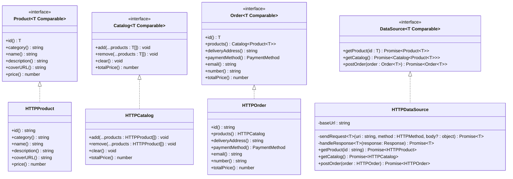

# Проектная работа "Веб-ларек"

Стек: HTML, SCSS, TS, Webpack

Структура проекта:

- src/ — исходные файлы проекта
- src/components/ — папка с JS компонентами
- src/components/base/ — папка с базовым кодом

Важные файлы:

- src/pages/index.html — HTML-файл главной страницы
- src/index.ts — точка входа приложения
- src/scss/styles.scss — корневой файл стилей
- src/utils/constants.ts — файл с константами
- src/utils/utils.ts — файл с утилитами

## Установка и запуск

Для установки и запуска проекта необходимо выполнить команды

```
npm install
npm run start
```

или

```
yarn
yarn start
```

## Сборка

```
npm run build
```

или

```
yarn build
```

## Документация

### Описание классов

#### `Product`

Интерфейс для работы с товарами.
Используется для моделирования товаров, которые могут быть добавлены в корзину или заказ.

#### `Catalog`

Интерфейс для работы с коллекцией товаров.
Используется для управления списками товаров в приложении, например, корзина или заказ.

#### `Order`

Интерфейс для работы с заказами.
Используется для моделирования и управления заказами пользователей.

#### `DataSource`

Интерфейс для взаимодействия с источниками данных.
Используется для абстракции источников данных, таких как API или базы данных.

### Диаграмма классов


